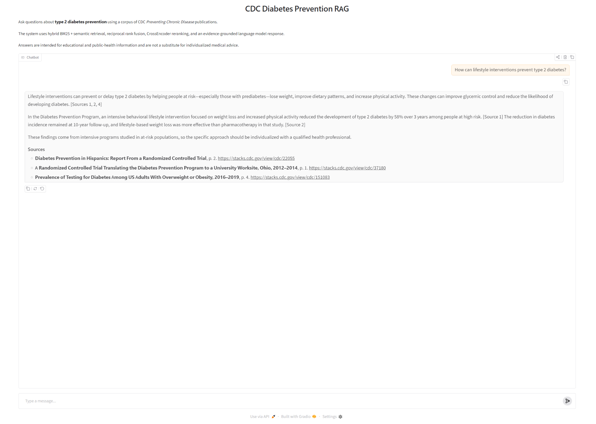

# CDC Diabetes Prevention RAG

An evidence-grounded Retrieval-Augmented Generation (RAG) system for answering questions about type 2 diabetes using scientific publications from the CDC *Preventing Chronic Disease* collection.

The project combines lexical and semantic retrieval, Reciprocal Rank Fusion, CrossEncoder reranking, evidence-constrained LLM generation, medical-safety prompting, and a multi-stage evaluation framework.

## Demo



The application retrieves evidence from CDC *Preventing Chronic Disease* publications and generates source-cited, evidence-grounded answers using hybrid retrieval and CrossEncoder reranking.

## 1. Project overview

Medical and public-health RAG systems need more than fluent answers. They need to retrieve relevant evidence, preserve the context of scientific findings, distinguish evidence from unsupported claims, and avoid inappropriate individualized medical advice.

This project implements an end-to-end RAG pipeline over a curated corpus of CDC publications related to type 2 diabetes.

The system:

1. retrieves relevant CDC evidence,
2. combines lexical and semantic search,
3. reranks candidate passages,
4. generates an evidence-grounded answer,
5. cites the retrieved CDC sources,
6. applies medical-safety constraints, and
7. evaluates both retrieval quality and final answer quality.

## 2. Source corpus

The corpus was constructed from the CDC Stacks *Preventing Chronic Disease* (PCD) collection.

Metadata filtering identified 74 publications associated with:

> `Medical Subject = Diabetes Mellitus, Type 2`

All 74 records are used in the local RAG corpus.

The public `knowledge_base/` directory contains only records explicitly tagged **Public Domain** in CDC Stacks metadata. Other locally processed documents and extracted text are excluded from the public repository.

### Local corpus

- 74 CDC/PCD publications
- 3,154 page-aware text chunks
- structured metadata including CDC ID, title, year, page, and source URL
- persistent dense embedding cache

### Public repository corpus

- 59 records explicitly tagged **Public Domain**
- Markdown source files stored in `knowledge_base/`

## 3. RAG architecture

```text
CDC Stacks / Preventing Chronic Disease
                  │
                  ▼
          Metadata filtering
                  │
                  ▼
          Full-text extraction
                  │
                  ▼
        Page-aware chunking
                  │
          ┌───────┴────────┐
          ▼                ▼
        BM25          Dense retrieval
          │                │
          └───────┬────────┘
                  ▼
       Reciprocal Rank Fusion
                  │
                  ▼
        CrossEncoder reranking
                  │
                  ▼
       Top evidence passages
                  │
                  ▼
     Evidence-grounded LLM prompt
                  │
                  ▼
       Answer + CDC references
```

## 4. Retrieval methods

Four retrieval configurations were evaluated.

### BM25

Lexical retrieval implemented with `rank-bm25`.

BM25 is particularly effective when benchmark questions share precise terminology, numerical values, or distinctive phrases with the source material.

### Dense retrieval

Semantic retrieval uses:

```text
sentence-transformers/multi-qa-mpnet-base-cos-v1
```

Embeddings for the 3,154 chunks are persisted locally so that they do not need to be recomputed on each run.

### Hybrid retrieval

BM25 and dense rankings are combined using Reciprocal Rank Fusion (RRF).

### Hybrid + CrossEncoder reranking

Hybrid candidates are reranked using:

```text
cross-encoder/ms-marco-MiniLM-L6-v2
```

The final chatbot pipeline uses hybrid retrieval followed by CrossEncoder reranking.

## 5. Evidence-grounded generation

The answer-generation prompt instructs the model to:

- answer from the supplied CDC evidence,
- avoid inventing facts, statistics, or sources,
- explicitly acknowledge insufficient evidence,
- cite retrieved sources,
- distinguish study findings from broader recommendations,
- preserve relevant population and study-setting limitations,
- avoid individualized diagnosis,
- avoid recommending that a user start, stop, or change medication, and
- communicate medical information clearly.

The chatbot is intended for educational and public-health information and is **not a substitute for individualized medical advice**.

## 6. Evaluation benchmark

The system was evaluated using a fixed benchmark of **20 questions**.

Each benchmark question was constructed from a human-selected CDC evidence passage.

The benchmark separates:

- the question presented to the RAG system,
- the reference answer used for evaluation, and
- the known reference source used for retrieval evaluation.

Reference answers and evidence are never supplied to the RAG system during answer generation.

## 7. Retrieval evaluation

Retrieval was evaluated in two complementary ways.

### 7.1 Known-reference evaluation

The human-selected source passage for each question provides a known relevant anchor.

Metrics include:

- Mean Reciprocal Rank (MRR)
- Recall@1
- Recall@3
- Recall@5
- Recall@10

Evaluation was performed at document, page, and exact-chunk levels.

A key result was that **BM25 performed particularly strongly for exact page and chunk retrieval**, showing the value of lexical matching for evidence-specific scientific questions.

### 7.2 Pooled graded relevance evaluation

A single reference passage does not represent every medically relevant document that could answer a question.

To address this limitation, candidate documents from the retrieval methods were pooled and manually assigned graded relevance:

```text
2 = directly relevant
1 = partially relevant / useful background
0 = not relevant
```

The final judgment pool contained:

- 68 question-document pairs
- 22 relevance-0 judgments
- 16 relevance-1 judgments
- 30 relevance-2 judgments, including known reference documents

Graded evaluation used:

- MRR
- Recall@1, @3, and @5
- nDCG@1, @3, and @5

### Graded retrieval results

| Method | MRR | Recall@1 | nDCG@1 | Recall@3 | nDCG@3 | Recall@5 | nDCG@5 |
|---|---:|---:|---:|---:|---:|---:|---:|
| BM25 | 0.9250 | 0.5446 | 0.9000 | 0.7173 | 0.8509 | 0.7244 | 0.8361 |
| Dense | **1.0000** | **0.6446** | **1.0000** | **0.8173** | **0.9399** | 0.8440 | **0.9353** |
| Hybrid | 0.9417 | 0.5446 | 0.9000 | 0.7339 | 0.8489 | 0.7494 | 0.8373 |
| Hybrid + reranking | 0.9750 | 0.5946 | 0.9500 | **0.8173** | 0.9233 | **0.8452** | 0.9149 |

### Interpretation

Dense retrieval achieved the strongest overall graded relevance performance.

Hybrid reranking produced the highest Recall@5, but only by a negligible margin:

```text
Dense:                 0.8440
Hybrid + reranking:    0.8452
```

This contrasts with the known-reference evaluation, where BM25 was stronger for exact page and chunk recovery.

The difference illustrates an important RAG evaluation issue: a retriever can fail to recover one predefined reference passage while still retrieving different documents that are medically relevant to the question.

## 8. Answer evaluation

Retrieval quality alone does not establish that the final generated answer is correct.

The final Hybrid + CrossEncoder RAG pipeline was therefore evaluated separately at the answer level.

Generated answers were semantically compared with human-constructed reference answers using an automated LLM-as-judge rubric:

```text
2 = fully correct
1 = substantially correct but missing an important point
0 = materially incorrect or misses the central answer
```

### Results

| Result | Count |
|---|---:|
| Fully correct | 19 |
| Partially correct | 1 |
| Incorrect | 0 |
| Total | 20 |

Overall score:

```text
39 / 40 = 97.5%
```

The automated evaluation therefore rated **19 of 20 answers fully correct, one partially correct, and none materially incorrect**.

This score is an automated semantic evaluation rather than a substitute for expert medical adjudication.

## 9. Failure analysis

The only partially correct answer was **Q08**, concerning demographic and geographic characteristics of U.S. adults with type 2 diabetes.

The generated answer correctly identified the South as the most common census region but did not recover several reference details, including:

- age distribution,
- socioeconomic characteristics, and
- the proportion living in urban areas.

Importantly, the model did not fabricate the missing statistics. It stated that the supplied evidence was insufficient to provide those details.

This represents a **conservative retrieval/context failure rather than a hallucinated answer**.

## 10. Why multiple evaluation methods matter

The evaluation produced a useful contrast:

- **BM25** was strong at retrieving the exact known reference passage.
- **Dense retrieval** was strongest when alternative medically relevant documents were accepted.
- **Hybrid + reranking** achieved a slightly higher Recall@5 than dense retrieval.
- The final RAG pipeline nevertheless achieved **97.5% answer-level semantic accuracy** on the benchmark.

This demonstrates why RAG systems should not be evaluated using only one retrieval metric or one predefined reference passage.

Retrieval evaluation and answer evaluation measure different parts of the system.

## 11. Repository structure

```text
cdc_diabetes_rag/
├── app.py
├── evaluator.py
├── rag_pipeline.ipynb
├── implementation/
│   ├── __init__.py
│   ├── retrieval.py
│   ├── embeddings.py
│   ├── hybrid_retrieval.py
│   ├── reranker.py
│   ├── prompts.py
│   └── answer.py
├── evaluation/
│   ├── questions.json
│   ├── retrieval_evaluation.ipynb
│   ├── generate_sample_answers.py
│   ├── evaluate_answers.py
│   └── answer_evaluation.json
├── scripts/
│   ├── map_reference_chunks.py
│   └── validate_reference_chunks.py
├── knowledge_base/
│   └── public-domain CDC documents
├── assets/
├── data/
└── source_documents/
```

Large local corpus files, embeddings, retrieved passages, and evidence-containing evaluation artifacts are intentionally excluded from the public repository.

## 12. Key implementation files

- `implementation/retrieval.py` — BM25 lexical retrieval
- `implementation/embeddings.py` — dense retrieval and persistent embedding cache
- `implementation/hybrid_retrieval.py` — Reciprocal Rank Fusion
- `implementation/reranker.py` — CrossEncoder reranking
- `implementation/prompts.py` — evidence-grounding and medical-safety instructions
- `implementation/answer.py` — end-to-end RAG answer pipeline
- `app.py` — Gradio chatbot
- `evaluator.py` — quantitative retrieval evaluation
- `evaluation/retrieval_evaluation.ipynb` — retrieval analysis and graded relevance evaluation
- `evaluation/generate_sample_answers.py` — benchmark answer generation
- `evaluation/evaluate_answers.py` — automated semantic answer evaluation
- `scripts/map_reference_chunks.py` — benchmark-to-corpus reference mapping
- `scripts/validate_reference_chunks.py` — benchmark mapping validation

## 13. Running the project

Create and activate a Python virtual environment and install the project dependencies.

Set the OpenAI API key in a local `.env` file:

```text
OPENAI_API_KEY = your_api_key
```

The `.env` file should not be committed to Git.

Run the chatbot:

```powershell
python app.py
```

Run retrieval evaluation:

```powershell
python evaluator.py
```

Generate benchmark answers:

```powershell
python .\evaluation\generate_sample_answers.py
```

Run automated answer evaluation:

```powershell
python .\evaluation\evaluate_answers.py
```

## 14. Local data and reproducibility

Some artifacts are intentionally not included in the public repository because they contain full-text or extracted passages from CDC Stacks records that are not explicitly tagged Public Domain.

These include local:

- source PDFs,
- extracted Markdown,
- chunk stores,
- embedding caches,
- retrieval-result files containing full passage text,
- reference evidence passages, and
- human relevance-review files containing evidence excerpts.

The public repository therefore demonstrates the implementation, evaluation methodology, benchmark questions, public-domain knowledge base, and aggregate evaluation results without redistributing the complete local corpus.

## 15. Limitations

This project has several important limitations.

First, the benchmark contains only 20 questions and is intended as a focused portfolio evaluation rather than a clinical validation study.

Second, pooled relevance judgments depend on the candidate documents retrieved by the evaluated systems and therefore do not represent exhaustive relevance judgments over the entire corpus.

Third, the CrossEncoder reranker is a general information-retrieval model rather than a model specifically trained for medical literature.

Fourth, the 97.5% answer score is based on automated semantic evaluation. Expert human review remains preferable for final medical validation.

Finally, the system is designed for evidence-grounded educational information, not diagnosis, treatment selection, medication dosing, or individualized medical decision-making.

## 16. Future work

Potential extensions include:

- comparing final answer quality using dense-only retrieval versus hybrid reranking,
- sentence- or structure-aware chunking,
- medical-domain reranking models,
- larger physician-reviewed benchmark sets,
- multidimensional answer evaluation for correctness, completeness, evidence grounding, citation accuracy, study-context fidelity, and medical safety,
- automated citation verification,
- highlighted source evidence in original PDF pages, and
- broader CDC diabetes and chronic-disease corpora.

## 17. Data source and attribution

Source corpus:

**Centers for Disease Control and Prevention (CDC), Preventing Chronic Disease / CDC Stacks**

The corpus was constructed from the CDC Stacks
[Preventing Chronic Disease](https://stacks.cdc.gov/cbrowse?parentId=cdc%3A19611&subject_topic%5B%5D=Diabetes+Mellitus%2C+Type+2&maxResults=100)
collection, filtered for:

`Medical Subject = Diabetes Mellitus, Type 2`
The public `knowledge_base/` contains only records explicitly tagged **Public Domain** in the CDC Stacks metadata used during corpus construction.

The presence of a document in CDC Stacks should not by itself be interpreted as a statement that every hosted document is in the public domain.

## 18. Disclaimer

This project is a research and software-engineering demonstration.

The generated information is intended for educational and public-health purposes only and should not be used as a substitute for professional medical advice, diagnosis, or treatment.

## 19. License

The original software and code in this repository are licensed under the MIT License. See [LICENSE](LICENSE).

CDC publications and source materials are not licensed under the MIT License by this repository. The public `knowledge_base/` contains only CDC Stacks records explicitly identified as Public Domain during corpus construction.
